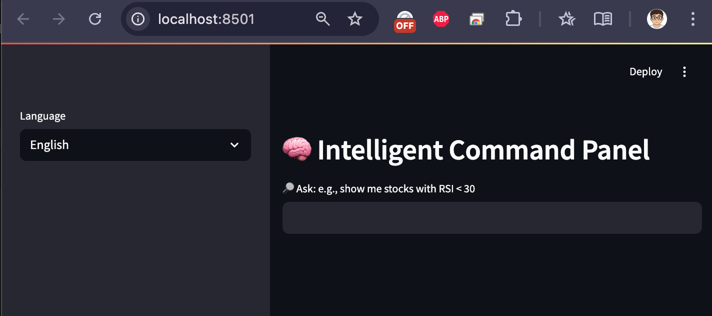

# FinSage

🤖 A language-model-driven AI assistant for financial insight, with intelligent natural language queries and real-time chart generation.

## 🔍 Features

- Natural language query: "Show me stocks with RSI < 30"
- Fetch real-time stock data via `yfinance`
- Calculate technical indicators: SMA, RSI (via `ta`)
- Predict next-day close using `RandomForestRegressor`
- Visualize price trends and LLM-inferred logic
- Fully integrated with local LLMs (Ollama or custom endpoints)

## 🧠 Powered By

- `Streamlit` – interactive web UI
- `yfinance` – stock data API
- `ta` – technical indicators
- `scikit-learn` – ML prediction
- `joblib` – model serialization
- `requests` – LLM call
- Optional: `Ollama` local LLM or any OpenAI-compatible backend

## 🚀 Getting Started

```bash
git clone https://github.com/frankchiboy/FinSage.git
cd FinSage
pip install -r requirements.txt
streamlit run stock_dashboard.py
# Then open http://localhost:8501 in your browser
```

### 🖼️ Example UI

After starting the app, you should see an interface like this in your browser:



### 🧰 Optional: Use Virtualenv (Recommended)

To avoid dependency conflicts, it's recommended to use a virtual environment:

```bash
python3 -m venv venv
source venv/bin/activate
pip install -r requirements.txt
```

## 🧠 LLM Integration (Optional)

To enable local language model explanations (via Ollama):

```bash
# Start Ollama server
ollama serve
# Download & run model
ollama run llama4
```

Ensure your model server is accessible at `http://localhost:11434`.

Edit `stock_dashboard.py` to point to your own API server or cloud endpoint if needed.
